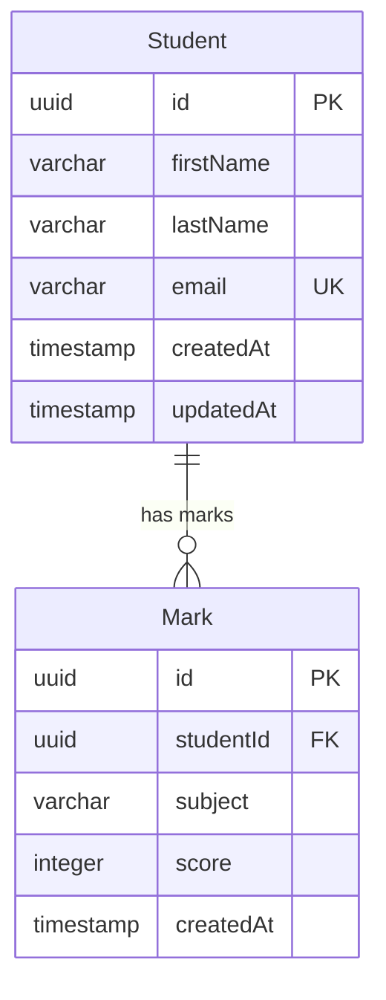
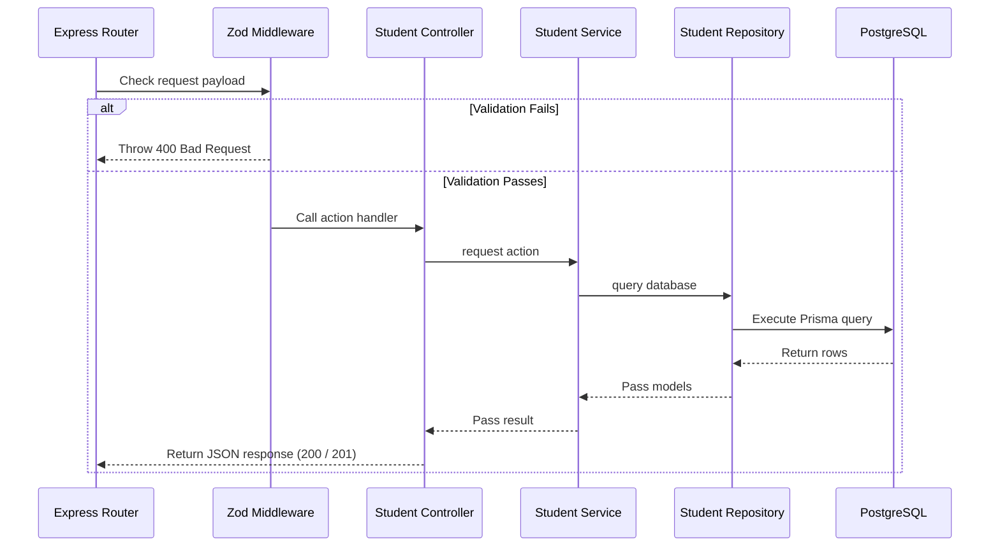

# Zeerostock Backend API Server

This is the Node.js API server for the **Zeerostock Student Management System (SMS)**. It is built as a RESTful web service using Express, TypeScript, and Prisma ORM to interact with a PostgreSQL relational database.

---

## 🛠️ Backend Tech Stack

*   **Runtime Environment**: Node.js v18+
*   **Web Framework**: Express.js
*   **Language Compiler**: TypeScript 6
*   **Database ORM**: Prisma v5 (PostgreSQL Client generator)
*   **Database Engine**: PostgreSQL 15
*   **Schema & Body Validation**: Zod

---

## 🏛️ Architecture Explanation

The server is structured around the **Controller-Service-Repository pattern**, separating HTTP handling from business rules and database queries:

```text
src/
├── config/       # Environment variables & prisma client exports
├── controllers/  # Receives requests, triggers validations, returns JSON responses
├── database/     # DB connections
├── middlewares/  # Schemas validators & Global Error interceptors
├── repositories/ # Abstracted DB queries using Prisma Client
├── routes/       # Endpoint configurations (student.routes.ts)
├── services/     # Core database business logic & operations
├── types/        # TypeScript custom types and interfaces
├── utils/        # Generic error handler classes
└── validators/   # Zod body validation schemas (createStudent, addMark)
```

---

## 💾 Database Schema & Cascade Delete

The application defines a one-to-many relationship between **Students** and **Marks**:



*   **ON DELETE CASCADE Constraint**: In `schema.prisma`, the relation is configured with `onDelete: Cascade`. Removing a `Student` record automatically deletes all their grade records (`Mark`) in a single database transaction, preventing orphans.

---

## ⚡ API Request Lifecycle Flow



---

## ⚙️ Setup & Installation Instructions

### Prerequisites
Make sure **Node.js v18+** and **NPM** are installed.

### 1. Database Setup
Ensure that a local **PostgreSQL** instance is running on your machine on port `5432` with a database named `sms_db`. You can configure the user credentials and DB details inside the `.env` file.

### 2. Dependency Installation
Navigate into the `backend` directory and install packages:
```bash
cd backend
npm install
```

### 3. Environment Configuration
Create a `.env` file in the `backend` folder:
```env
PORT=
DATABASE_URL=
FRONTEND_URL=
```

### 4. Database Migrations
Generate and run migrations to create the tables in PostgreSQL:
```bash
npx prisma migrate dev --name init
```

### 5. Database Seeding
Seed the database with initial student listings and marks:
```bash
npx prisma db seed
```

### 6. Start Development Server
```bash
npm run dev
```
The server will run on **`http://localhost:5000/api/v1`**.

---

## 📝 Assumptions Made

1.  **Unique Email Constraint**: Student email addresses are unique. Attempting to save a duplicate email returns a `409 Conflict` (or `400 Bad Request` validation error).
2.  **CORS Access**: CORS origins are restricted to `http://localhost:5173` (Vite's default port).
3.  **Cascade Delete Operations**: Associated student mark sheets are deleted instantly when a student profile is deleted.
